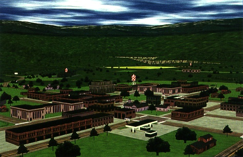

## SGI Performer
_SGI Performer binaries and source archive_

As far as I can tell, the only source released for Performer was for the demos and utility libraries.  SGI ported Performer to Windows and Linux and called it "OpenGL Performer".

Currently, this archive contains two versions:

1. OpenGL Performer 3.0 for Windows.  Intriguingly, this Windows version of Performer *does* include debug libs and PDBs for the core Performer library.  So it may be possible to recover Performer source via Ghidra, AI, and some determination.

2. SGI's oss.sgi.com Performer source.  This can also be found at [archive.org](https://web.archive.org/web/20171010104701/http://oss.sgi.com/cgi-bin/cvsweb.cgi/performer/), so consider this archive a more friendly Github mirror of this old CVSweb mirror.

Linux version to be added later.
